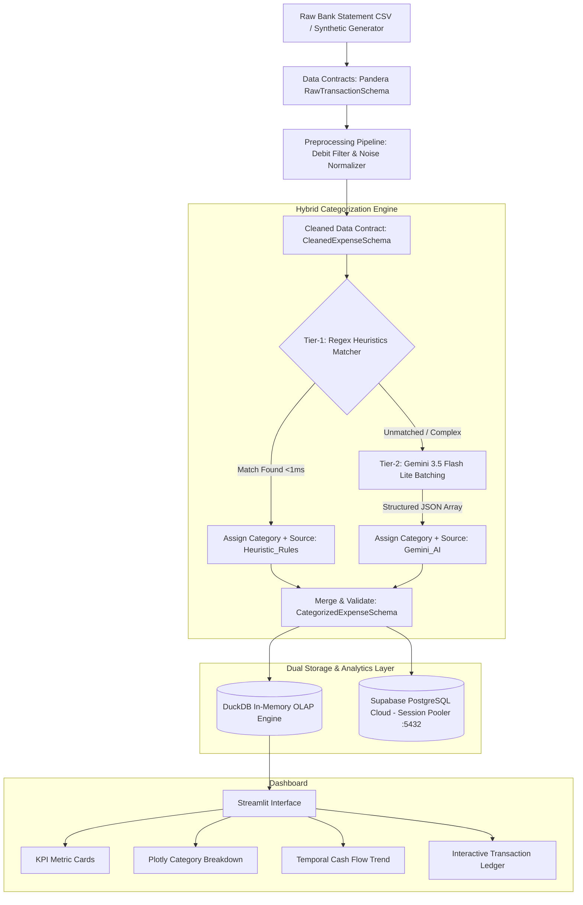

# Expense Categorizer

[](https://www.python.org/downloads/)
[](https://pandera.readthedocs.io/)
[](https://duckdb.org/)
[](https://supabase.com/)
[](https://streamlit.io/)

An automated expense classification pipeline and analytical dashboard for Indonesian bank statements. It matches known recurring transactions through local regex heuristics (<1ms, $0 cost) and routes ambiguous descriptions to Google Gemini 3.5 Flash Lite in batches. Aggregations run locally in DuckDB, and records persist to Supabase PostgreSQL.

## Live Demos
- Local dashboard: `streamlit run app.py`
- Cloud BI report: [Looker Studio Dashboard](https://datastudio.google.com/s/qnY-dLgdh9s)

---

## System Architecture



---

## Architecture and Engineering Choices

### 1. Two-Tier Hybrid Pipeline
- **Tier-1 heuristics (`src/rules_engine.py`)**: matches recurring merchants (PLN, PDAM, BPJS, Telkomsel, GoFood, Grab) via regex in under 1ms with zero API cost.
- **Tier-2 LLM batching (`src/llm_categorizer.py`)**: sends remaining unclassified merchants to Gemini 3.5 Flash Lite in a single JSON array request.
- **Cost control**: tier-1 handles roughly 70–80% of transactions, cutting external API calls to the remaining 20–30%.

### 2. Pandera Data Contracts
- **Boundary validation**: enforces strict column types, positive amounts, ISO-8601 dates, and valid mutation types (`Debit`/`Credit`).
- **Fail-fast errors**: rejects malformed statement rows before preprocessing or inference.

### 3. Dual Storage Architecture
- **In-memory OLAP (DuckDB)**: runs analytical queries and aggregations in RAM (<1ms) for the Streamlit UI.
- **Cloud persistence (Supabase PostgreSQL)**: connects via session pooler (`aws-0-ap-southeast-1.pooler.supabase.com:5432`) over SSL, bypassing direct IPv6 routing limits.

### 4. Streamlit Dashboard
- Uses an asymmetric 70:30 layout (distribution chart on the left, ranking table on the right).
- Styled with neutral slate dark mode (`#09090b`), corporate blue accents (`#0284c7`), and transparent Plotly charts without decorative icons.

---

## Project Structure

```text
ai-expense-categorizer/
├── docs/
│   ├── PRD.md                  # Product requirements and SLAs
│   ├── ARCHITECTURE.md         # Architecture decisions and schemas
│   └── IMPLEMENTATION.md       # Implementation checklist and traceability
├── src/
│   ├── schemas.py              # Pandera data contracts (Raw, Cleaned, Categorized)
│   ├── data_generator.py       # Indonesian bank statement generator (Faker)
│   ├── preprocessing.py        # Debit filtering and description normalization
│   ├── rules_engine.py         # Tier-1 regex heuristics
│   ├── llm_categorizer.py      # Tier-2 Gemini batch categorizer
│   ├── categorizer.py          # Hybrid engine orchestrator
│   ├── db_duckdb.py            # In-memory DuckDB queries
│   └── db_supabase.py          # Supabase PostgreSQL connector
├── tests/
│   ├── test_pipeline.py        # Unit tests for preprocessing and schema validation
│   ├── test_categorization.py  # Unit tests for heuristics and hybrid pipeline
│   └── test_storage.py         # Unit tests for DuckDB aggregation
├── app.py                      # Streamlit dashboard
├── requirements.txt            # Python dependencies
├── .env.example                # Environment variables template
└── README.md                   # Project documentation
```

---

## Installation and Setup

### 1. Clone the Repository
```bash
git clone https://github.com/brianilham/ai-expense-categorizer.git
cd ai-expense-categorizer
```

### 2. Install Dependencies
```bash
pip install -r requirements.txt
```

### 3. Configure Environment Variables
Create a `.env` file in the root directory:
```env
# Google Gemini API
GEMINI_API_KEY=your_gemini_api_key_here

# Supabase PostgreSQL (Session Pooler)
user=postgres.your_project_ref
password=your_database_password
host=aws-0-ap-southeast-1.pooler.supabase.com
port=5432
dbname=postgres
```

---

## Running Unit Tests

Run pytest to check data contracts, preprocessing, and analytical queries:
```bash
pytest
```
*Expected: 7 passed.*

---

## Running the Dashboard

Start the Streamlit application:
```bash
streamlit run app.py
```
Open `http://localhost:8501` in your browser.

---

## Standard Expense Categories
1. **F&B (Food & Beverages)**: Warteg, Resto, Cafe, Kopi, GoFood, GrabFood, ShopeeFood.
2. **Belanja (Groceries & Shopping)**: Indomaret, Alfamart, Superindo, Tokopedia, Shopee.
3. **Transportasi**: GoJek, Grab, Pertamina, Shell, Tol, Kereta, MRT.
4. **Utilitas & Tagihan**: PLN, PDAM, BPJS, Telkom, Indihome, Pulsa.
5. **Hiburan & Langganan**: Netflix, Spotify, bioskop, game voucher.
6. **Kesehatan**: Apotek, Kimia Farma, Halodoc, Rumah Sakit.
7. **Pendidikan**: Kursus, buku, seminar, biaya kuliah.
8. **Transfer Keluar**: Pengiriman dana antar bank / e-wallet.
9. **Biaya Admin & Pajak**: Biaya admin bank bulanan, materai, biaya transaksi.
10. **Lainnya**: Pengeluaran tak terklasifikasi / anomali.

---

## License
MIT License.
