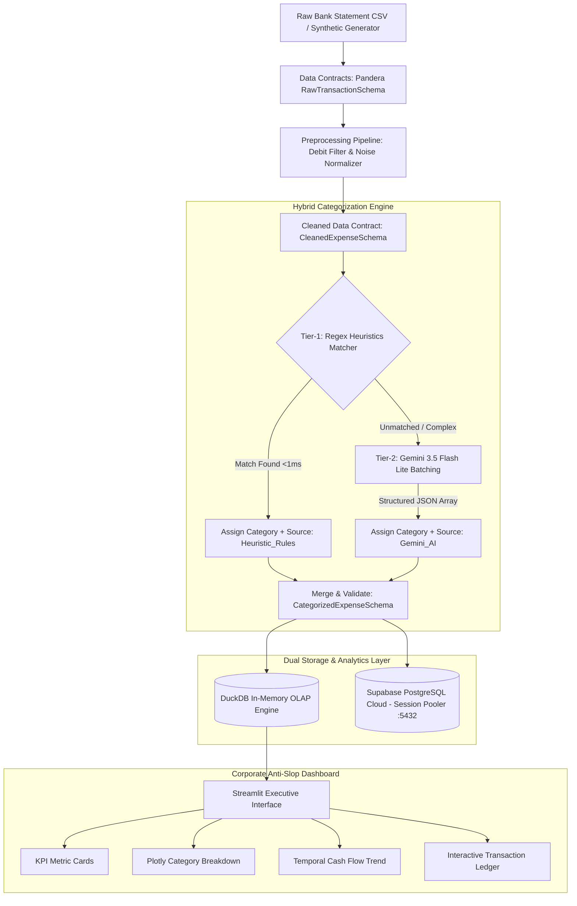

# Enterprise Expense Intelligence & Categorization Platform

[](https://www.python.org/downloads/)
[](https://pandera.readthedocs.io/)
[](https://duckdb.org/)
[](https://supabase.com/)
[](https://streamlit.io/)

Production-grade, AI-augmented expense classification engine and analytical intelligence platform built using **Spec-Driven Development (SDD)**. Integrates a **Two-Tier Hybrid Architecture** (sub-millisecond Heuristics + batched Gemini 3.5 Flash Lite), **Pandera Data Contracts** for fail-fast schema validation, **In-Memory DuckDB OLAP** for instant query execution (<1ms), and an executive dashboard adhering to the **21 Anti-Slop Corporate Design Rules**.

## 🌐 Live Demos
- **Streamlit Local Application:** `streamlit run app.py`
- **Interactive Cloud BI Report:** [View Looker Studio Dashboard](https://datastudio.google.com/s/qnY-dLgdh9s)

---

## 🏗️ System Architecture



---

## 🚀 Key Engineering Highlights

### 1. Two-Tier Hybrid Categorization Engine
- **Tier-1 Heuristics (`src/rules_engine.py`)**: Deterministic regex matching for recurring Indonesian banking transactions (PLN, PDAM, BPJS, Telkomsel, GoFood, Grab, etc.) resolving in `<1ms` with **$0 API cost**.
- **Tier-2 LLM Batching (`src/llm_categorizer.py`)**: Batched inference via **Google Gemini 3.5 Flash Lite** with JSON-enforced output schema, minimizing API roundtrips and token consumption.
- **Cost Reduction**: Achieves ~70–80% zero-cost direct matches, drastically cutting cloud inference overhead.

### 2. Contract-First Engineering with Pandera
- **Fail-Fast Ingestion**: Enforces strict typing, positive-only amounts, ISO-8601 date formats, and valid transaction types (`Debit`/`Credit`).
- **Zero Schema Drift**: Ensures broken or malicious bank statement rows are caught at the boundary before entering analytical storage or LLM pipelines.

### 3. Dual Storage Architecture
- **In-Memory OLAP (DuckDB)**: Powers dashboard charts and aggregated metrics with sub-millisecond query execution (`<1ms`).
- **Cloud Persistence (Supabase PostgreSQL)**: Uses **Session Pooler** (`aws-0-ap-southeast-1.pooler.supabase.com:5432`) with IPv4 compatibility and SSL enforcement.

### 4. High-Taste Corporate Dashboard (Streamlit)
- Implements the **21 Anti-Slop Corporate Design Rules**:
  - **Zero Emojis**: Strictly formal typography and clean enterprise visual hierarchy.
  - **Micro-Borders (`1px solid rgba(255,255,255,0.10)`)** over heavy drop-shadows.
  - **Corporate Blue (`#0284c7`)** theming on a dark slate canvas (`#09090b`).
  - **Asymmetric Grid (`70:30`)** for dominant visual insights vs. tabular breakdown.
  - **Tufte Zero Chart-Junk Plotly Charts** with transparent backgrounds and high-contrast labels.

---

## 📂 Project Structure

```text
ai-expense-categorizer/
├── docs/
│   ├── PRD.md                  # Product Requirements Document & SLAs
│   ├── ARCHITECTURE.md         # Architecture Decision Records (ADRs) & Schemas
│   └── IMPLEMENTATION.md       # SDD 5-Phase Checklist & Traceability
├── src/
│   ├── schemas.py              # Pandera Data Contracts (Raw, Cleaned, Categorized)
│   ├── data_generator.py       # Realistic Indonesian Bank Statement Generator (Faker)
│   ├── preprocessing.py        # Debit filtering & description normalization
│   ├── rules_engine.py         # Tier-1 Heuristics & merchant regex matcher
│   ├── llm_categorizer.py      # Tier-2 Gemini 3.5 Flash Lite batch categorizer
│   ├── categorizer.py          # Hybrid Engine Orchestrator
│   ├── db_duckdb.py            # In-memory DuckDB OLAP aggregator
│   └── db_supabase.py          # Supabase PostgreSQL Session Pooler connector
├── tests/
│   ├── test_pipeline.py        # Unit tests for preprocessing & Pandera contracts
│   ├── test_categorization.py  # Unit tests for Heuristics & Hybrid pipeline
│   └── test_storage.py         # Unit tests for DuckDB aggregation & KPIs
├── app.py                      # Anti-Slop Corporate Streamlit Dashboard
├── requirements.txt            # Python dependencies
├── .env.example                # Template for environment credentials
└── README.md                   # Enterprise Documentation
```

---

## ⚙️ Installation & Setup

### 1. Clone & Setup Environment
```bash
git clone https://github.com/brianilham/ai-expense-categorizer.git
cd ai-expense-categorizer
```

### 2. Install Dependencies
```bash
pip install -r requirements.txt
```

### 3. Configure Environment Variables
Create a `.env` file in the root directory:
```env
# Google Gemini API
GEMINI_API_KEY=your_gemini_api_key_here

# Supabase PostgreSQL (Session Pooler Configuration)
user=postgres.your_project_ref
password=your_database_password
host=aws-0-ap-southeast-1.pooler.supabase.com
port=5432
dbname=postgres
```

---

## 🧪 Running Unit Tests

Run the full pytest suite to verify data contracts, preprocessing, and analytical aggregations:
```bash
pytest
```
*Expected result: 7 passed in < 4s.*

---

## 📊 Launching the Dashboard

Launch the corporate analytical dashboard:
```bash
streamlit run app.py
```
Open your browser at `http://localhost:8501`.

---

## 📋 Standard Expense Categories
1. **F&B (Food & Beverages)**: Warteg, Resto, Cafe, Kopi, GoFood, GrabFood, ShopeeFood.
2. **Belanja (Groceries & Shopping)**: Indomaret, Alfamart, Superindo, Tokopedia, Shopee.
3. **Transportasi**: GoJek, Grab, Pertamina, Shell, Tol, Kereta, MRT.
4. **Utilitas & Tagihan**: PLN, PDAM, BPJS, Telkom, Indihome, Pulsa.
5. **Hiburan & Langganan**: Netflix, Spotify, bioskop, game voucher.
6. **Kesehatan**: Apotek, Kimia Farma, Halodoc, Rumah Sakit.
7. **Pendidikan**: Kursus, buku, seminar, biaya kuliah.
8. **Transfer Keluar**: Pengiriman dana antar bank / e-wallet.
9. **Biaya Admin & Pajak**: Biaya admin bank bulanan, materai, biaya transaksi.
10. **Lainnya**: Pengeluaran tak terklasifikasi / anomali.

---

## 📄 License
MIT License. Built for enterprise data portfolio demonstration.
