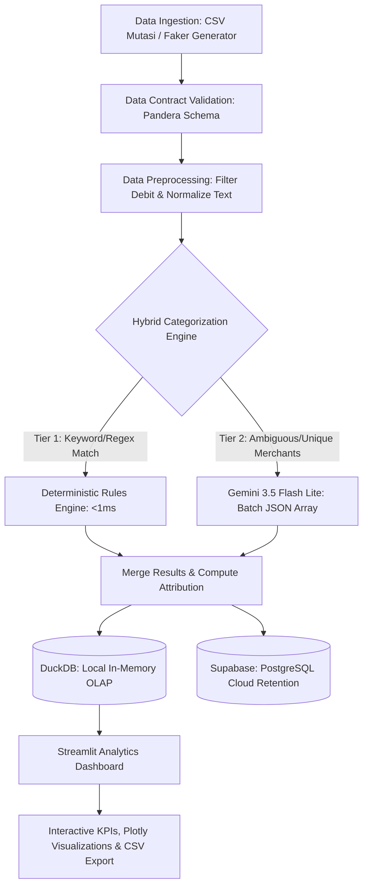

# System Architecture and Data Flow

## 1. High-Level Data Flow



---

## 2. Tech Stack and Tooling

| Komponen | Tools Pilihan | Alasan Pemilihan |
| :--- | :--- | :--- |
| **Data Acquisition** | **Faker + Kamus Merchant Indonesia** | Menghasilkan 150+ baris mutasi realistis (BCA, Mandiri, GoPay, QRIS) tanpa ketergantungan API eksternal. |
| **Data Contract** | **Pandera** | Deklaratif, memvalidasi tipe data dan rentang nilai di batas sistem sebelum pemrosesan. |
| **Heuristic Engine** | **Python Regex / Dictionary Map** | Pencocokan deterministik instan (<1ms), tanpa biaya API, menyelesaikan 40–60% transaksi umum. |
| **AI Inference** | **Google Gemini 3.5 Flash Lite (REST)** | Menangani transaksi ambigu secara batch dengan format JSON terstruktur. |
| **Analytics Engine** | **DuckDB** | Embedded OLAP tanpa dependensi server terpisah, kueri agregasi berjalan di bawah 5ms. |
| **Cloud Storage** | **Supabase PostgreSQL (Session Pooler)** | Penyimpanan jangka panjang via pooler port 5432 untuk menjamin kompatibilitas jaringan IPv4. |
| **Frontend** | **Streamlit** | Antarmuka analitik interaktif berbasis Python. |
| **Testing Suite** | **pytest** | Pengujian unit otomatis untuk kontrak data, logika pembersihan, dan agregasi. |

---

## 3. Architecture Decision Records (ADR)
<details>
<summary>Rationale dan trade-off teknis</summary>

* **Hybrid (Rules + LLM) vs Full LLM**:
  Mengirim seluruh baris transaksi ke LLM membuang waktu dan kuota. Transaksi seperti `"PAYMENT PLN TOKEN"` atau `"SPOTIFY"` memiliki pola tetap yang dapat diselesaikan oleh regex dalam <1ms. LLM hanya digunakan sebagai fallback untuk transaksi yang tidak cocok dengan aturan regex.
* **DuckDB bersama Supabase**:
  Supabase melayani penyimpanan transaksional (OLTP). Menjalankan kueri agregasi berulang dari dashboard ke database cloud menimbulkan latensi jaringan bolak-balik. DuckDB memproses kalkulasi agregasi langsung di memori lokal secara instan.
* **Pandera di Pintu Awal (Fail-Fast)**:
  Nilai nominal negatif, format tanggal yang salah, atau kolom yang hilang harus ditolak di awal sebelum data diproses oleh engine kategorisasi atau database.
</details>

---

## 4. Schema Specifications

### A. Raw Ingestion Schema (`src/schemas.py`)
```python
import pandera as pa
from pandera.typing import Series

class RawTransactionSchema(pa.DataFrameModel):
    Date: Series[str] = pa.Field(nullable=False, description="Tanggal transaksi format YYYY-MM-DD")
    Amount: Series[float] = pa.Field(ge=0, nullable=False, description="Nominal transaksi positif")
    Type: Series[str] = pa.Field(isin=["Debit", "Credit"], nullable=False, description="Tipe mutasi")
    Raw_Description: Series[str] = pa.Field(nullable=False, str_length={"min_value": 3}, description="Keterangan transaksi")
```

### B. Cleaned and Categorized Schema
```python
class CategorizedExpenseSchema(pa.DataFrameModel):
    Date: Series[str] = pa.Field(nullable=False)
    Amount: Series[float] = pa.Field(ge=0, nullable=False)
    Raw_Description: Series[str] = pa.Field(nullable=False)
    Clean_Description: Series[str] = pa.Field(nullable=False)
    Category: Series[str] = pa.Field(isin=[
        "F&B", "Belanja", "Transportasi", "Utilitas", 
        "Hiburan", "Kesehatan", "Pendidikan", "Transfer Keluar", 
        "Biaya Admin & Pajak", "Lainnya"
    ])
    Source: Series[str] = pa.Field(isin=["Heuristic_Rules", "Gemini_AI", "Fallback"])
```

---

## 5. Failure Modes and Mitigation
- **Koneksi atau Kuota Gemini Habis**: Jika panggilan API gagal atau kuota terlampaui (HTTP 429), sistem menetapkan label fallback `"Lainnya"` dan mencatat statusnya tanpa menghentikan pipeline.
- **Dukungan Jaringan IPv4**: Menggunakan Supabase Session Pooler (`aws-0-ap-southeast-1.pooler.supabase.com:5432`) dengan `sslmode=require` untuk menghindari kegagalan koneksi pada provider internet yang belum mendukung IPv6.
- **Validasi Nilai Ekstrem**: Pandera menolak mutasi dengan nilai `Amount` negatif atau nol sebelum tahap kalkulasi pengeluaran.
